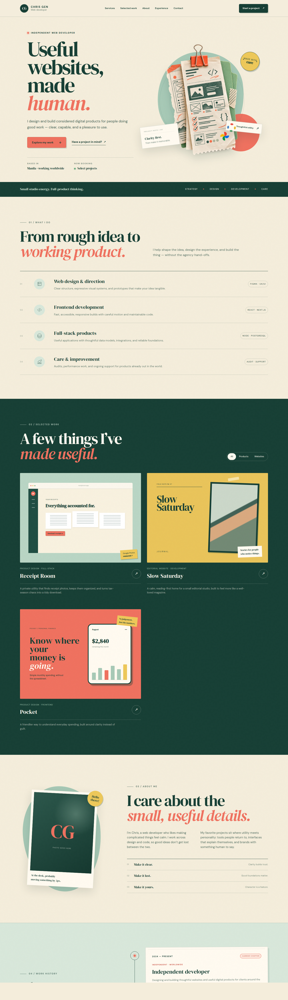

# Chris Gen — Portfolio

A warm, editorial-style personal portfolio for showcasing web development services, selected work, experience, and contact details. The visual direction combines a paper-inspired bookkeeping aesthetic with a modern, responsive interface.



## Highlights

- Bespoke illustrated receipt-stack hero
- Services, selected work, about, and work-history sections
- Responsive project gallery with category filters and loading feedback
- Contact form with validation, offline status, error, and success states
- Mobile navigation and single-column responsive layouts
- Accessible semantic HTML and reduced-motion support
- Custom CSS without Tailwind or a component library

## Built with

- HTML5
- Custom CSS
- Vanilla JavaScript
- [Vite](https://vite.dev/) for local development and production builds

## Getting started

Install the dependencies:

```bash
pnpm install
```

Start the local development server:

```bash
pnpm dev
```

Then open the local URL shown by Vite, usually `http://localhost:5173`.

## Production build

```bash
pnpm build
```

The optimized production files are written to `dist/`.

## Project structure

```text
.
├── assets/
│   └── receipt-stack.webp
├── screenshot/
│   └── cgd-fullpage-check.png
├── src/
│   ├── main.js
│   └── styles.css
├── index.html
├── package.json
└── pnpm-lock.yaml
```

## Customization

Before publishing, replace the placeholder portfolio content in `index.html`:

- Biography and portrait
- Project names and case-study links
- Employment history
- Email address
- GitHub and LinkedIn URLs

The contact form currently demonstrates the complete frontend experience. Connect it to a form service or backend endpoint to deliver real messages.

## Design system

The interface uses a cream paper background, dark forest-green typography, coral accents, and muted mint surfaces. Editorial serif headings are paired with clean sans-serif body copy, supported by subtle grain, paper shadows, stamps, and receipt-inspired cards.

## License

This is a personal portfolio project. All rights reserved.
